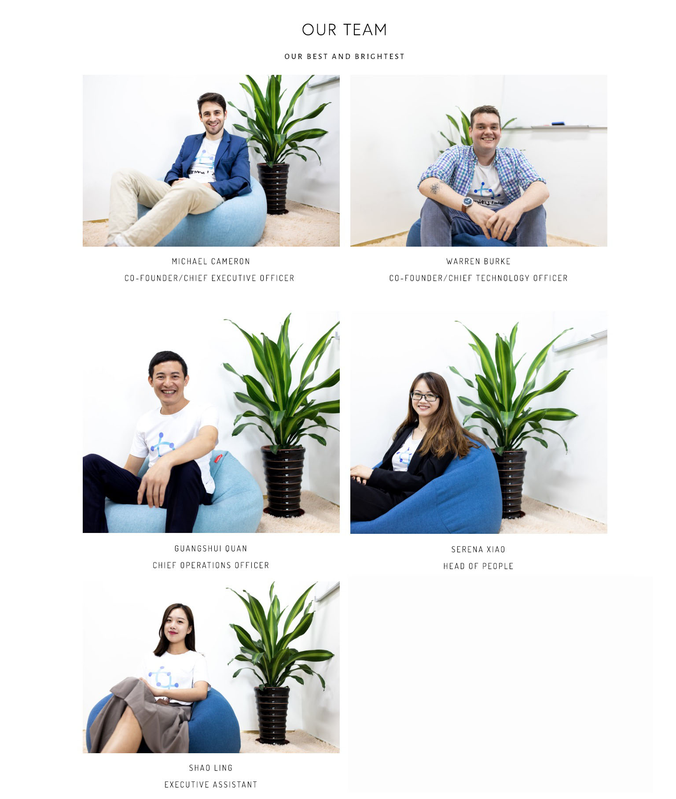
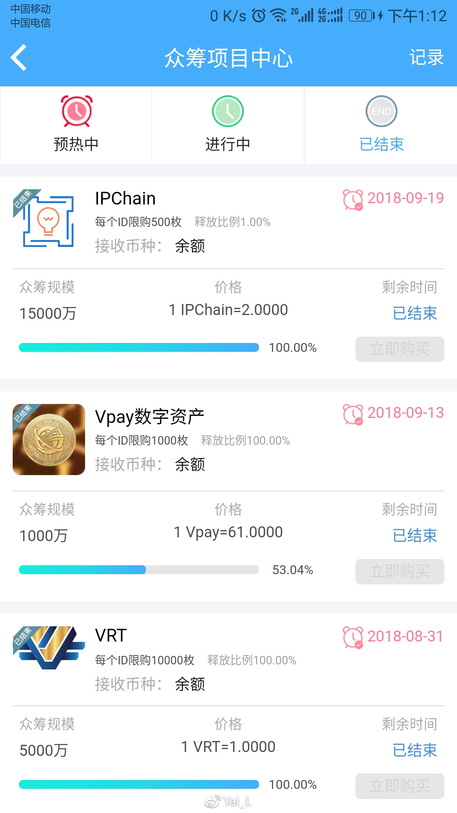
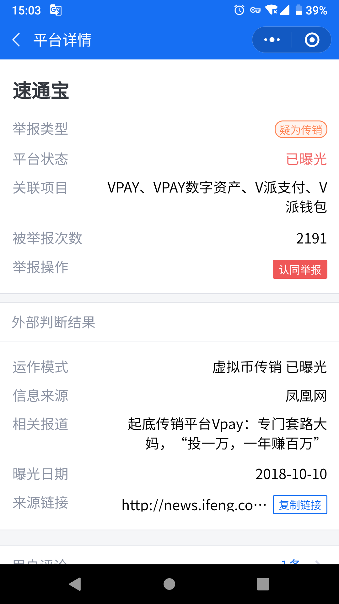
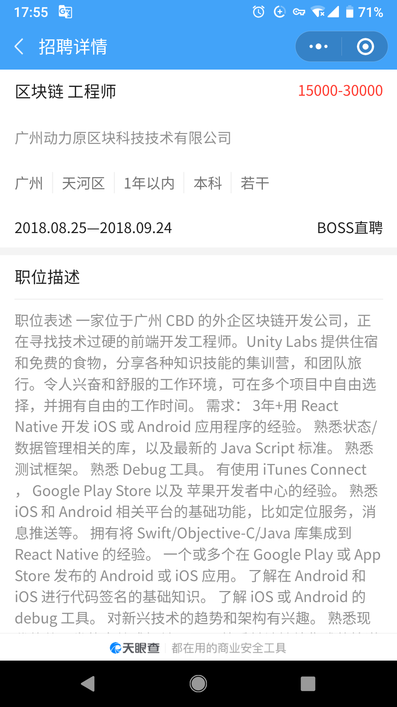
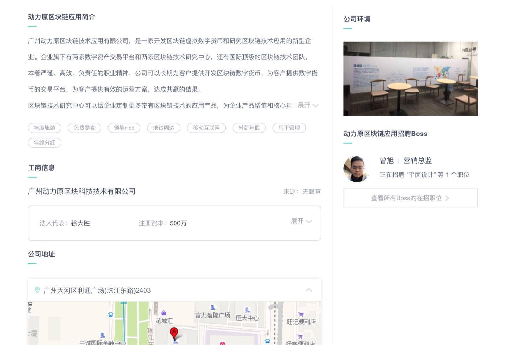
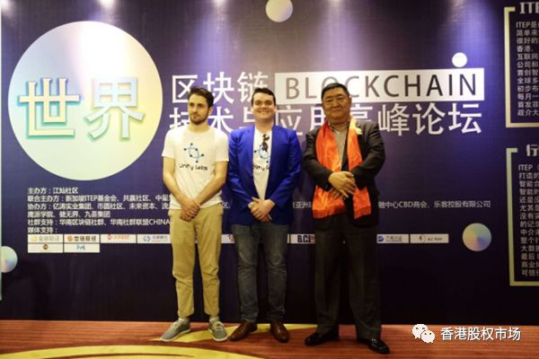
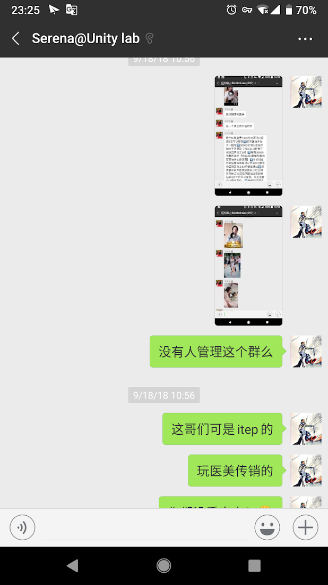
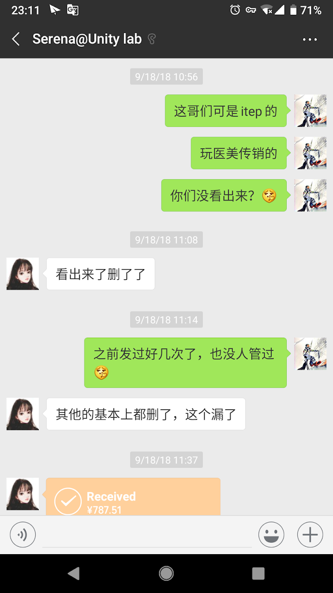

# Unity Labs，联合实验（广州）科技有限公司涉嫌打着区块链名义进行涉嫌传销等金融诈骗活动！

## 概述

> 本人已对 Unity Labs 提起劳动仲裁，虽然对仲裁结果不抱期望，这里之所以将整个过程发表出来，更多的是为了方便后续有人跳进同一个坑，再继续被这样的不良公司欺骗。

这是一家中外合资的区块链公司，严格意义来讲是一家中国股东控股的中外合资公司，COO，Guangshui Quan，中文名全广水，为公司实际控制人，通过“[广州全联科技有限公司](https://www.tianyancha.com/company/3270429980)”占有 Unity Labs 63% 的股份，股份可看[天眼查](https://www.tianyancha.com/company/3271832509)。官网 [unitylabs.io](https://www.unitylabs.io)

### 核心团队:

Unity Labs 法人为 CAMERON MICHAEL SEAN JASON，简称 Michael，拥有 32% 的股份，CTO 为 BURKE WARREN MATTHEW JOHN，简称 Warren，拥有 5% 的股份，其中肖姗( Serena Xiao )通过全联拥有若干股份，为公司后勤负责人，三人为 Unity Labs 高管团队，负责所有日常事物。在公司 COO 全广水（公司实际控制人）的带领下，通过注册多个国内外实体，规避现有的法律条款，**长时间隐瞒员工**的情况下进行以区块链为名义的**_传销等金融诈骗_**活动。

## 事情经过

本人作为其团队某项目组负责人，负责某个产品的部分移动端、全部后端以及部分的客户需求沟通，大概是于十月份中旬，不经意的浏览中看到某群发送的消息[起底传销平台Vpay：套路大妈 “投一万，一年赚百万”](http://tech.sina.com.cn/csj/2018-10-11/doc-ifxeuwws3018912.shtml)，日常与 CEO 和 CTO 的沟通中多次有提到音似 vpay 相关的词语，网上搜索[vpay](https://www.google.com/search?hl=en&q=vpay)，原以为是一家有些规模美国的虚拟支付公司，并未在意。直到某天看到上述关于 vpay 的报道，才将其与传销关联，并通过网络搜索发现诸多与其相关的报道，其中在这篇文章中[救救被洗脑的妈妈们吧！面对传销币骗局我该怎么办？](https://www.weibo.com/ttarticle/p/show?id=2309404289596258182807)发现公司主力在做的项目 [IPCHAIN](https://www.ip-chain.io/) 居然与一个规模颇大的传销骗局关系如此之紧密！

经过与多位同事的信息交叉验证，IPCHAIN 与 Vpay 机密的合作关系得到了证实，在 CTO 与 CEO 对此毫不知情均是 COO 全广水一人操办的假设下，将对此的担心告知 CTO 与 CEO 并寻求两位的答复。其多次表明对 vpay 传销相关的事情并不了解，并且经过咨询多个律师以寻求一种合适的解决方案，同时进行损失控制，曾多次提出 Unity Labs 只是"技术服务提供商".

从 10.20 号前后开始的所谓[IPChain 全球矿池启动大会](http://quzheng.baidu.com/s/yQzQzq)开始全球路演，第一站便在广州，期间虽然有中断，但迫于投资人全广水的多次施压，活动又开始大量展开。

十一月中旬某外籍同事拒绝参加当时的路演演讲，导致全广水在其后的下午找团队核心成员交流谈心，[此录音](https://goo.gl/KF2mHn)此为与其的详细沟通，时间长达 2 小时，其中有谈到其发家经历、创办此公司的原因、以及与 vpay 的合作方式等等。得知其早期通过多个区块链资金盘项目获得不少资金。

最终，在某个周五的公开例会上公开提出此事，以及对于未告知员工的情况下使用员工肖像参加 vpay 等涉嫌传销活动的宣传等，可预知的是，下一周周一便被 CEO、CTO、人事、律师共计四人约谈并强制解除劳动合同，CEO CTO 曾多次强烈表态当天必须签订协议，由于本人的前期项目造成的诸多加班调休、应休年假、承诺的带薪休假，以及单方非法解除劳动合同的经济补偿等未达成一致，劳动合同解除协议至今未签，并于不久前将诉求与相关证据提交劳动仲裁进行仲裁，虽然对于劳动仲裁的结果不抱什么期望，但是对于应属于自己的合法权益是需要站出来捍卫。本人对于劳动仲裁的整个过程也有较为详细的记录，希望能把我个人的经历通过这种形式开放出来，方便其他人少走弯路。

## 其他相关证据

在被 Fire 之后的几周内，通过多方的信息查找，之前部分的零散信息之间慢慢有了些联系。

vpay（别名速通宝）在腾讯小程序灵鲲金融安全中的查询结果

[IPCHAIN 挖矿策略](http://quzheng.baidu.com/s/Mb6rYb)，一移动端钱包，外加后端的增删改查就上线了这种所谓的“挖矿”

[IPCHAIN 在 vpay 第二轮众筹](http://quzheng.baidu.com/s/AZBRVj)

广州动力原区块科技技术有限公司和 Unity Labs 之间的关系,天眼查中留存的通过动力原区块链进行招聘的记录

[广州动力原区块科技技术有限公司 旗下的 “超艺魔方”品牌 ](https://www.qichacha.com/firm_eec5fc9a92cd09eecbf2403f85f9fd13.html#assets)

[网络搜索的 “超艺魔方” 结果，又一款打着所谓的区块链挖矿的传销产品](https://www.google.com/search?hl=en&q=%E8%B6%85%E8%89%BA%E9%AD%94%E6%96%B9)

[动力原区块链的 coindora 币多啦](https://www.google.com/search?hl=en&q=coinDora+%E5%B8%81%E5%A4%9A%E5%95%A6)

[全广森(全广水兄弟)担任股东的“区块链公司” 传销应用 coindora 的开发方，看今朝(广州)信息科技有限公司，专门为 vpay, 一类公司提供技术开发，正在清算中](https://www.qichacha.com/firm_003e26bdaa0f8fc71166c420cc16e4ca.html)

[全广森担任股东的中科国链，办公地址在广晟国际，Unity Labs 第一个临时办公地址](https://www.qichacha.com/firm_030451ffce5dd416c6928307510a2988.html)

Unity Labs CEO Michael 及 CTO Warren 参加[世界区块链技术与应用高峰论坛(2018.06.17)](https://www.chainlab.tech/portal/article/index/id/27289.html)的合影，有意思的是通过搜索参会人员如“共享医美科技创始人总裁屈前宇先生”，“ITEP亚太服务中心总裁屈前宇先生”，便可知道这种活动的性质如何了，两位老外在此的角色。

关于这位 ITEP 及这位医美先生，愿意为他们早已主动知道，并撇清关系。9.18 曾向 Serena 提起此事。

## 关键人物

1. 全广水，多个项目投资人及操盘手
2. 徐大胜，动力原法人，超艺魔方操盘手
3. 全广森，全广水兄弟，通过其入股“看今朝”，通过全联拥有 Unity Labs 63% 股份。
4. Michael，Unity Labs CEO，之前曾为全广水多个其他资金盘项目站台，拥有 Unity Labs 32% 股份
5. Warren，Unity Labs CTO 拥有 Unity Labs 5% 股份
6. Serena，Michael 女友，英语专业毕业，曾担任英语培训机构教师，负责 Michael 与全广水及其他中国人之间的翻译，公司人事行政事物等
7. Shao ling 全广水助理，带领十几人的团队负责 IPCHAIN 活动路演

## 关键公司

1. Unity Labs，[联合实验（广州）科技有限公司](https://www.tianyancha.com/company/3271832509)，Michael 担任法人
2. [全链国际控股(广州)有限公司](https://www.qichacha.com/firm_46003ea9db2f3f7fe3e4b841bacfa1b4.html)，全广水担任法人，徐大胜为监事
3. [广州全联科技有限公司](https://www.tianyancha.com/company/3270429980)，全广水为法人，肖姗（Serena）为股东，最近（12.5）发生股东变更。
4. [广州动力原区块科技技术有限公司](https://www.qichacha.com/firm_eec5fc9a92cd09eecbf2403f85f9fd13.html)，全广水与徐大胜共同运营 coindora 币多啦，超艺魔方等资金盘项目的公司。
5. [看今朝(广州)信息科技有限公司](https://www.qichacha.com/firm_003e26bdaa0f8fc71166c420cc16e4ca.html)，全广森拥有 20% 股份的“区块链”开发公司，为 coindora 币多啦 提供开发服务。
6. [中科国链(广州)区块链科技有限公司](https://www.qichacha.com/firm_030451ffce5dd416c6928307510a2988.html),全广森拥有 25% 股份的“区块链”开发公司，Unity Labs 在广晟国际时的临时办公点。

### 为传销活动设计运作方案、计算机软件，提供技术服务的组织和个人，其行为属于为传销活动提供便利条件的行为，应当承担相应的法律责任。

引自[长春市工商行政管理局](http://www.ccgs.gov.cn/view-c43a29a1ee104e0a99df5b8205a808b4-c30a102d9c7a4b1a9b83f7d4c6df37a6.html)

> 需要注意的是，上述违法行为的构成不要求当事人明知或应知，实施为传销提供便利条件的行为即属违法。但对提供社会公共服务的单位，邮政、电信、公共交通等单位，在非明知或应知时，不构成违法。其他法律法规另有规定的，从其规定，另外，违法的行为不仅仅限于《禁止传销条例》第二十六条列举的几种，其他如：为传销提供培训服务、为传销组织设计制度、为传销活动设计计算机软件等等，凡是为传销提供便利条件的行为都是法律法规所禁止的，构成犯罪的，还要依法追究刑事责任。

## 经验教训

1. 文中多个链接的百度取证服务，也是通过这次事情才找到的这样一家在线取证服务，当然时间稍稍有些晚了，导致很多对方对网站进行修改前并未进行有效取证，之后遇到类似的事情，第一个想到的肯定是「百度取证」服务。
2. 由于公司的规章制度相对宽泛，以及对某人的过度信任，相当长时间内并没有很好的加班申请及上下班打卡机制，导致在统计加班时，需要提供很多其他证据进行作证，甚至如代码提交记录，协作软件的操作记录等等。
3. 一定要找在乎名誉的公司！！！